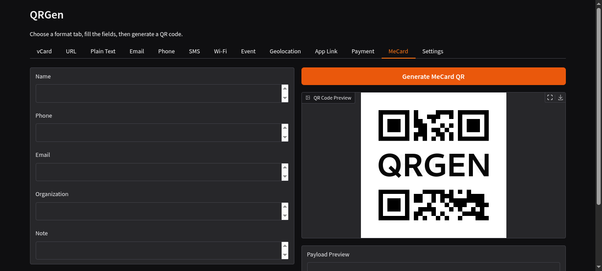
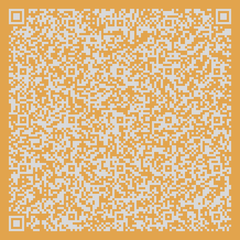

# QRGen

<div align="center">

</div>

## Summary

For my **CS50P** [Final Project](https://cs50.harvard.edu/python/2022/project/), I created a single-purpose application that generates vCards in QR code format. Originally built as a desktop app specifically for vCards, it has since been migrated to a browser-based interface powered by **Gradio** and has been expanded to support multiple QR code formats and customization options.

## Todo

- [ ] Debig customization options so FG and BG colors are applied correctly
- [ ] Add configuration saving/loading/resetting for user preferences and session persistence
- [ ] Deploy to a public web server for easy access

## Features

This application allows users to generate a high-quality Quick Response (QR) codes for various data types. These codes can be scanned by most modern mobile devices, making them ideal for embedding contact details on business cards, resumes, or marketing materials.

- **Responsive Web UI**: Access the tool via your browser with a modern look and feel.
- **Customization**: Change QR colors, sizes, shapes, gradients, borders, headers and footers, error correction levels and more.
- **Branding**: Upload a logo or image to overlay in the center of the QR code.
- **Multiple QR Formats**: Support for various QR code data types beyond vCards.
- **Language Support**: Interface available in multiple languages for broader accessibility.

## Supported QR Formats

1. **vCard** – Electronic business card format for sharing contact information.
2. **URL** – Links to web resources.
3. **Plain Text** – Simple text data.
4. **Image** – Links to image resources.
5. **Email** – Pre-filled email addresses or templates (e.g., `mailto:` links).
6. **Phone Number** – Click-to-call phone numbers (e.g., `tel:` links).
7. **SMS** – Pre-filled SMS messages (e.g., `sms:` links).
8. **Wi-Fi Credentials** – Network SSID and password for quick Wi-Fi access.
9. **Calendar Event** – Event details that can be added to a user's calendar.
10. **Geolocation** – GPS coordinates for maps and navigation.
11. **App Links** – Deep links to open or install mobile applications.
12. **Payment Information** – Payment requests or cryptocurrency addresses.
13. **meCard** – A simplified version of vCard for mobile devices.

## Supported Languages

- Afrikaans
- English
- Spanish

Please refer to the `qrgen/i18n.py` for available language files. Contributions for additional translations are welcome!

## Setup

The project now uses **uv** for extremely fast and reliable dependency management. Make use of this one-liner for a quick setup.

```bash
git clone https://github.com/m-spangenberg/qr-vcard-generator && cd qr-vcard-generator/ && make init
```

Alternatively, you can manually set up the environment:

```bash
# Clone the repository
git clone https://github.com/m-spangenberg/qr-vcard-generator
cd qr-vcard-generator/

# Sync dependencies
uv sync

# Launch the Gradio web interface
uv run python main.py
```

### vCard Format

The vCard, or otherwise known as the VCF (Virtual Contact File) format is essentially a container format for contact information that can be shared between electronic devices, notably mobile phones.

With every entry on a new line, the `.vcf` format must always begin with `BEGIN:VCARD`, followed immediately by the version identifier `VERSION:4.0`, and must end with `END:VCARD`.

#### Example layout

```bash
BEGIN:VCARD
VERSION:4.0
KIND:individual
EMAIL;TYPE=work:j.appleseed@acmeappleco.bar
EMAIL;TYPE=work:j.appleseed@foo.bar
TITLE:Apple Seed Distributor
ROLE:Project Leader
FN:Johnny Appleseed
BDAY:19850412
ADR;TYPE=HOME:pobox;ext;street;locality;region;code;country
TEL;TYPE=CELL:+123 12 123 1234
TEL;TYPE=WORK:+123 12 12 1234
TEL;TYPE=HOME:+123 12 12 1234
TEL;TYPE=FAX:+123 12 12 1234
URL: https://www.example.com
TZ: Africa/Windhoek
ORG: ACME Apple Co. - Will take precedence over Full Name.
NOTE: optional note, keep it short
END:VCARD
```

#### Example QR Code

<div align="center">

</div>  

### Testing and Development

To set up the environment and install all dependencies:

``` bash
make init
```

To perform unittests with `pytest`:

``` bash
make test
```

Or manually using `uv`:

```bash
# Perform unittests
uv run pytest
```

### Acknowledgements

Thank you to David Malan and his entire team for helping to make Harvard's CS50 accessible to anyone who wants to learn.

#### Further Reading

If you intend to fork this project, see the following links for helpful information on vCards.

* [Internet Engineering Task Force](https://datatracker.ietf.org/doc/html/rfc6350) - Format Specification
* [World Wide Web Consortium](https://www.w3.org/2002/12/cal/vcard-notes.html) - Format Notes
* [Wikipedia](https://en.wikipedia.org/wiki/VCard) - vCards

#### Libraries Used

The following libraries and tools are used to make this project possible:

* [Gradio](https://gradio.app/) - Modern web interface framework
* [qrcode](https://pypi.org/project/qrcode/) - Generating high-quality QR codes
* [Pillow](https://pypi.org/project/Pillow/) - Image processing and branding support
* [uv](https://github.com/astral-sh/uv) - Fast Python package management
* [pytest](https://pypi.org/project/pytest/) - Testing framework
* [ruff](https://pypi.org/project/ruff/) - Linting and code formatting
